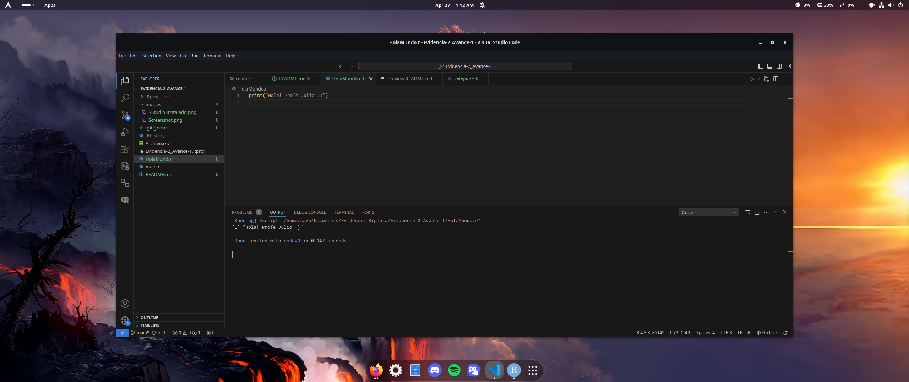
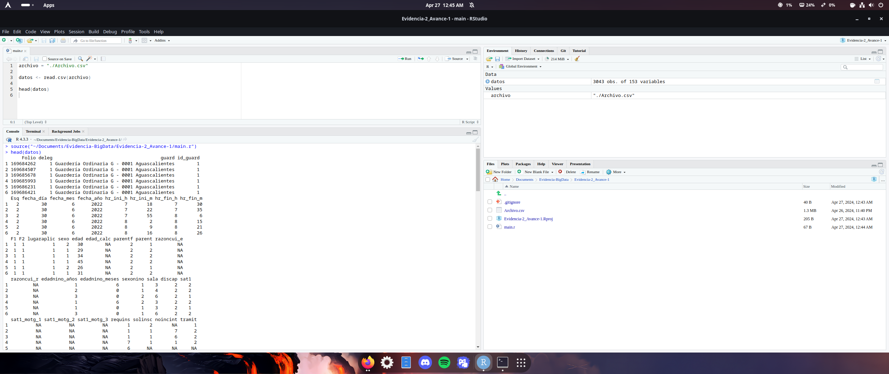

# Avance de la segunda evidencia de Big Data

Trabajo realizado por **Cristian Santiago Matus Gutiérrez** (SaVa-dev).
Creado para la materia de Fundamentos de programación para Big Data.

## Instrucciones

Los requerimientos de la eviencia, fueron los siguientes:

- Instalar la versión más actual de R Studio desde https://rstudio.com/
- Descargar el IDE (Integrated Development Environment) de tu preferencia
- Comprobar que la instalación de R Studio creando un archivo .R que imprima Hello World.
- Ingresar a la siguiente liga y descarga el archivo del programa de Participación Social en Guarderías del IMSS: http://datos.imss.gob.mx/dataset/participacion-social-enguarderias/resource/f30ff883-2895-494a-8c12-ef256392b805
- Investigar sobre el método frame y utilízalo para realizar la importación de los datos descargados.

## Preparar el ambiente de R en el equipo de cómputo donde se realizará el análisis.

### Instalación de R

Para la instalación de R y RStudio, se usaron los package manager pacman (Arch Linux) y yay (Arch Linux), para instalarlo desde los repositorios de Arch Linux [AUR](https://aur.archlinux.org/)
Para instalarlo, se ejecutaron los siguentes comandos en bash:

**Comando para instalar RLang**
``` bash
# Instalar RLang
$ sudo pacman -S r
```

Una vez instalado, procederemos a instalar RStudio con la herramienta [Yay](https://github.com/Jguer/yay).

**Comando para instalar RStudio con Yay**

``` bash
# Instalar RStudio
$ yay -S rstudio-desktop-bin
```

Una vez instalado ambos, ya podemos comenzar a programar en R con el IDE de RStudio.


## Comprobar que RLang funcione correctamente

### Hola Mundo

Ya que RLang, está instalado, podemos entrar desde una terminal, y escribir el comando `R` directamente en la terminal, o en su defecto, se puede usar algún IDE para escribir el programa.
En mi caso, se usó [Visual Studio Code](https://code.visualstudio.com/) con la extensión de R para escribir y ejecutar el [programa](./HolaMundo.r).



## Manipulación del archivo en RLang

### Archivo

Una vez realizados los pasos anteriores, se descargó el [archivo](./Archivo.csv) del IMSS del año 2010 al 2019.

## Código escrito en R

Se pidió investigar que era el método `frame()`, y es un método que permite crear arreglos de dos dimensiones. Tambien se pidió abrir el [archivo CSV](./Archivo.csv) en R para poder revisar el contenido de los datos, y para esto se usó la función `read.csv()`, y poder convertir el contenido del [archivo CSV](Archivo.csv) en el arreglo bidimensional.

En el código, se agregó la función `head()` para poder visualizar la cabeza de los datos del archivo.



*yalanetatengosueñoprofe, y un chingo de tarea por delante, lo wa dejar hasta acá...*